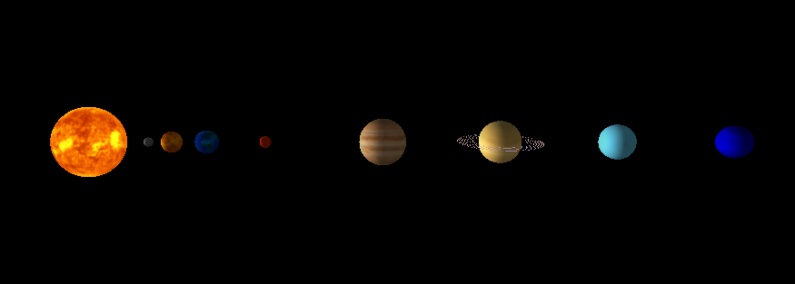

# SistemaSolar-ProjetoFinal
Projeto Final da Disciplina de Introdução À Computação Gráfica. Representação de um sistema solar com todos os seus componentes orbitando ao redor do Sol.



## Sobre o Projeto

Este projeto foi criado como um estudo prático de computação gráfica, implementando conceitos fundamentais como transformações 3D, texturização, iluminação e movimentação de câmera. A simulação apresenta os planetas orbitando o Sol e girando em seus próprios eixos.

## Funcionalidades

-   **Renderização 3D:** O Sol e os oito planetas do sistema solar são renderizados como esferas 3D
-   **Texturização:** Cada corpo celeste utiliza texturas realistas para representar sua superfície
-   **Iluminação Dinâmica:** O Sol atua como a única fonte de luz na cena, emitindo luz que ilumina os planetas e criando um efeito de dia e noite
-   **Movimento Orbital e Rotação:** Os planetas orbitam o Sol em velocidades relativas e giram em seus próprios eixos
-   **Inclinação Axial:** Alguns planetas são renderizados com suas respectivas inclinações axiais.
-   **Anéis de Saturno:** Renderização especial para os anéis de Saturno utilizando `gluDisk`.
-   **Câmera Interativa:** Teclado e mouse podem ser usados para controle de câmera, e explorar a visualização.
-   **Janela interativa:** a janela possui redimensionamento automático 

## Controles

| Ação                | Controle                               |
| ------------------- | -------------------------------------- |
| **Rotacionar Visão** | Arrastar o mouse com o botão esquerdo |
| **Zoom** | Teclas `W` / `S` ou Roda do Mouse        |
| **Mover Lateralmente** | Teclas `A` / `D`                         |
| **Resetar Visão** | Tecla `R`                                |
| **Fechar Programa** | Tecla `ESC`                              |

## Requisitos

Para compilar e executar este projeto, você precisa:

- Compilador GCC
- Bibliotecas de desenvolvimento OpenGL
- GLUT (OpenGL Utility Toolkit)
- Biblioteca STB Image (inclusa no projeto)

## Instalação de Dependências

Em sistemas baseados em Ubuntu/Debian, instale as dependências necessárias com:

```bash
sudo apt-get update
sudo apt-get install build-essential libgl1-mesa-dev freeglut3-dev
```

Em Windows faça o download e execute o instalador do freeglut

- [Link de download do freeglut para Windows](https://www.transmissionzero.co.uk/software/freeglut-devel/)

## Compilação e Execução no Windows

Utilize as seguintes linhas de comando para compilar e executar, respectivamente.

- gcc SistemaSolar.c -o SistemaSolar -lfreeglut -lopengl32 -lglu32
- .\SistemaSolar.exe

## Compilação e Execução no Linux

Utilize as seguintes linhas de comando para compilar e executar.

- gcc SistemaSolar.c -o SistemaSolar -lGL -lGLU -lglut && ./SistemaSolar

## Atribuições de cada integrante

### Natercio Roque

    - Gerenciamento do projeto e do repositório 
    - Adição das estruturas básicas do OpenGL
    - Criação dos planetas com todos os seus parâmetros físicos e distâncias
    - Rotação dos planetas ao redor do Sol
    - Inclinações axiais e rotações dos planetas ao redor de seus próprios eixos
    - Elaboração do README
    
### Aurélio Maciel

    - Implementação da interatividade do usuário (teclado, mouse e janela)
    - Funções para rotação, zoom e movimentação da câmera
    - Ajustes de redimensionamento da janela

### Luis Felipe

    - Implementação de texturas
    - Implementação da iluminação
    - Adição e adaptação do sistema de câmera para o código principal (SistemaSolar.c)
    - Correção de bugs da integração dos requisitos
    - Elaboração do README

## Principais problemas encontrados

1. Iluminação e Materiais: 
   Inicialmente, a iluminação estava deixando os planetas descoloridos, apresentando somente o reflexo luminoso. Isto foi resolvido com a aplicação de 'glEnable(GL_COLOR_MATERIAL)' mais 'glColorMaterial(GL_FRONT, GL_AMBIENT_AND_DIFFUSE)'.
   
   Após a integração com textura e movimentação, a luz não estava funcional. Foi percebido que a luz havia sido desabilitada na implementação dos anéis para Saturno, sendo assim necessário somente reativá-la após este processo.
3. Aplicação de Texturas:
    As texturas, originalmente, estavam com a aplicação espelhada, que foi facilmente resolvido com a próprio biblioteca "stb_image".
4. Representações Físicas Realistas:
    Não conseguimos a tempo representar as órbitas planetárias de forma realista, visto que a força gravitacional de cada planeta influencia as órbitas dos demais.
5. Configuração de eventos do teclado e mouse.
6. Compatibilidade entre plataformas. Algumas funções da janela apresentam diferenças entre Linux e Windows.
7. Oclusão durante o zoom.

## Possíveis Melhorias

1. Otimização de Janela:
    Poderiamos ter feito um modo de tela cheia para melhor visualização do sistema com a utilização de flags e funções de adequações para o novo modo.
2. Maior diversidade de teclas de atalho:
    Poderíamos ter adicionado mais teclas com outras funções. Por exemplo, acelerar ou diminuir a velociade de rotações do planeta, pausar a simulação, desabilitar a iluminação, etc.
3. Órbitas realistas e Ação da Gravidade no Sistema:
    Atualmente as órbitas planetárias são circulares, porém deveriam ser mais elípticas. Se formos levar a ação da gravidade em consideração, cada planeta deveria influenciar nas órbitas vizinhas. Isto poderia ser feito inplementando a lógica da física real na hora de calcular as posições de cada planeta.
